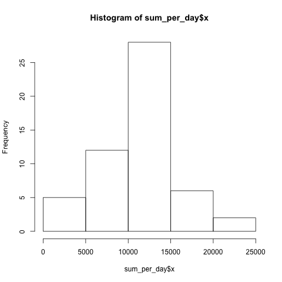
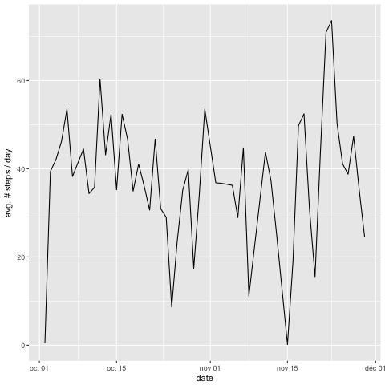
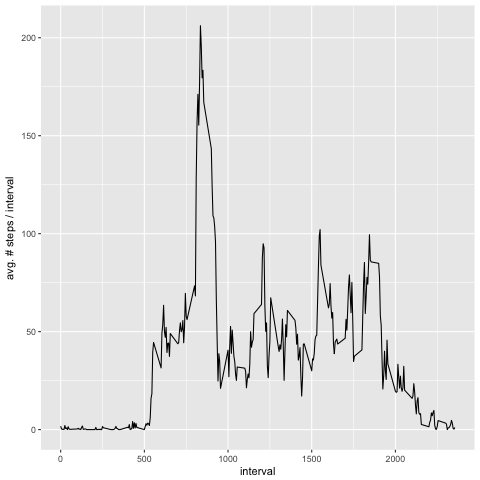

## Loading and preprocessing the data (including the code to describe and show a strategy for imputing missing data)
```{r echo=TRUE}
library(lubridate)
data<-read.csv("activity.csv",sep = ",",colClasses = NA,na.strings = "NA")
datac<-na.omit(data)
datev<-ymd(as.character(datac$date))
datac$date<-datev
```

## What is mean total number of steps taken per day?


Histogram of the total number of steps taken each day after missing values are imputed
```{r echo=TRUE}
sum_per_day<-aggregate(datac$steps, by=list(datac$date),sum)
png("histo_step.png")
hist(sum_per_day$x)
dev.off()
```


mean number of steps taken each day = 10766.19

median number of steps taken each day = 10765

```{r echo=TRUE}
library(ggplot2)
mean_per_day<-aggregate(datac$steps, by=list(datac$date),mean)
png("mean_per_day_ts.png")
ggplot(mean_per_day, aes(Group.1, x)) + geom_line() + xlab("date")+ ylab("avg. # steps / day")
dev.off()
```


## What is the average daily activity pattern?

The 5-minute interval that, on average, contains the maximum number of steps:
```{r echo=TRUE}
mean_for_each_interval<-aggregate(datac$steps,by=list(datac$interval),mean)
max(mean_for_each_interval$x)
[1] 206.1698
which.max(mean_for_each_interval$x)
[1] 104 
```
104 is the interval where maximum number (which is 207.1698) of average steps are taken.

This could also be visually seen in:



## Imputing missing values


## Are there differences in activity patterns between weekdays and weekends?
